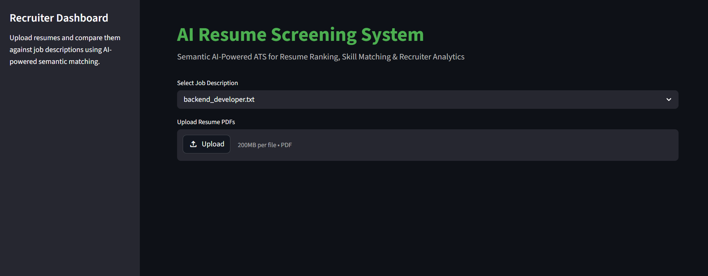
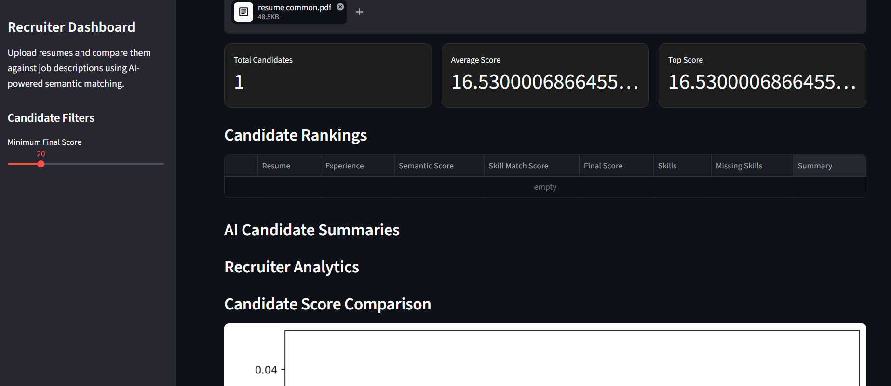
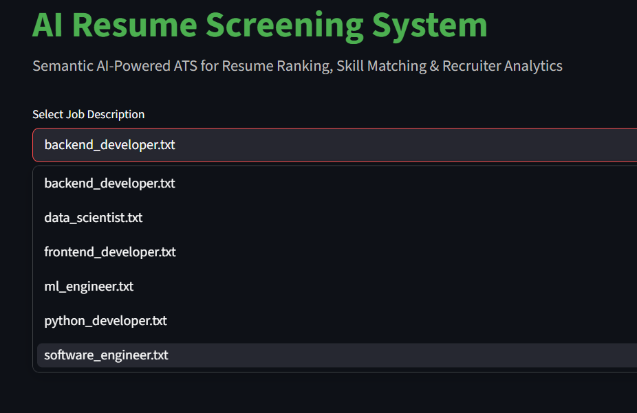
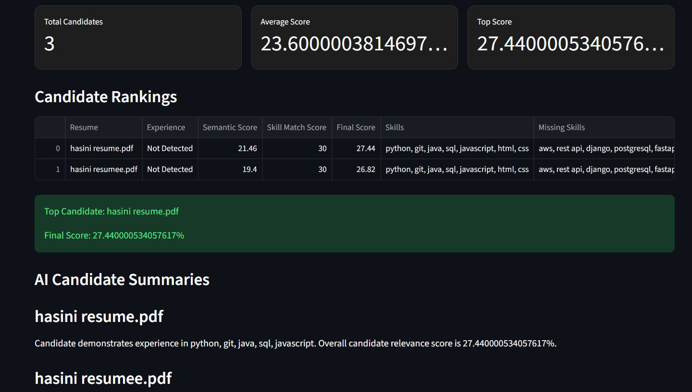
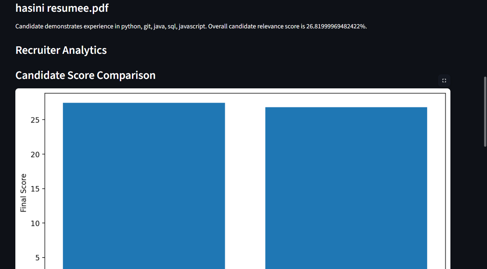
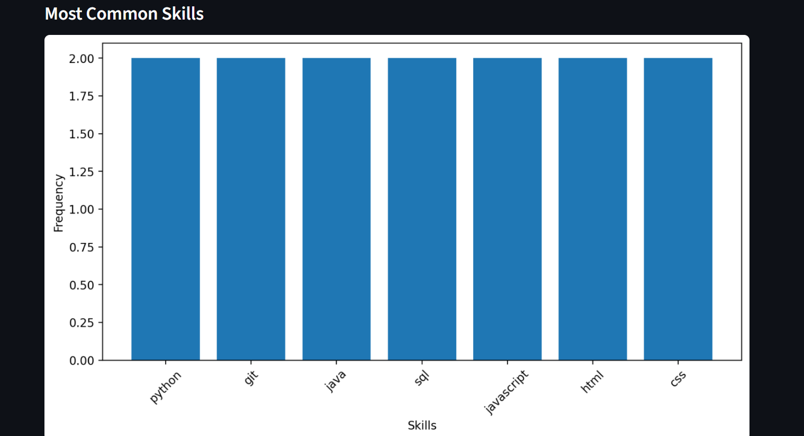
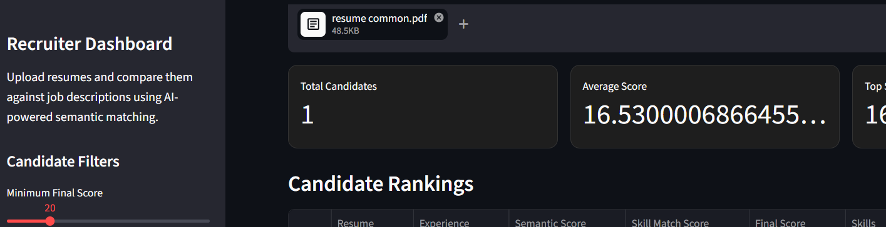
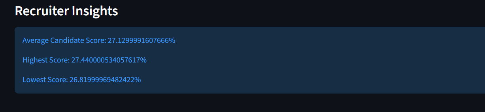

# AI Resume Screening System

An AI-powered Resume Screening and Candidate Ranking System built using NLP, Semantic Similarity, and Streamlit.

This project helps recruiters automatically screen resumes, compare them with job descriptions, rank candidates, identify missing skills, and generate recruiter-friendly insights.

---

# Features

- Resume PDF Parsing
- NLP-based Text Cleaning
- Skill Extraction
- Semantic Similarity Matching
- Resume-to-Job Description Comparison
- Candidate Ranking System
- Experience Extraction
- Education Extraction
- Missing Skill Detection
- AI Recruiter Summaries
- Recruiter Analytics Dashboard
- Candidate Filtering System
- Interactive Streamlit UI

---

# Tech Stack

## Frontend
- Streamlit

## Backend / NLP
- Python
- NLTK
- Scikit-learn
- Sentence Transformers
- PDFPlumber

## Visualization
- Matplotlib
- Pandas

---

# Project Structure

```text
resume-screening/
│
├── app/
│   ├── education_extractor.py
│   ├── experience_extractor.py
│   ├── resume_parser.py
│   ├── resume_summarizer.py
│   ├── semantic_similarity.py
│   ├── similarity_engine.py
│   ├── skill_extractor.py
│   └── utils.py
│
├── data/
│   ├── job_descriptions/
│   └── resumes/
│
├── streamlit_app.py
├── requirements.txt
├── README.md
└── .gitignore
```

---

# How It Works

1. Upload resume PDFs  
2. Select a job description  
3. System extracts:
   - skills
   - education
   - experience
4. NLP model compares resume with job description
5. Candidates are ranked based on:
   - semantic similarity
   - skill matching
6. Recruiter insights and analytics are displayed

---
## Live Deployment 

https://resumescreeningml.streamlit.app/ 


# AI Features

## Semantic Similarity

Uses Sentence Transformers (BERT embeddings) for intelligent resume-job matching.

## Skill Extraction

Extracts technical skills from resumes using NLP-based keyword matching.

## Experience Detection

Automatically detects years of experience from resume text.

## Education Extraction

Identifies qualifications such as:
- B.Tech
- MBA
- MCA
- Engineering
- Computer Science

## AI Recruiter Summaries

Generates recruiter-friendly candidate summaries automatically.

---

# Installation

## Clone Repository

```bash
git clone https://github.com/your-username/ai-resume-screening-system.git
```

## Move Into Project Folder

```bash
cd ai-resume-screening-system
```

## Create Virtual Environment

```bash
python -m venv venv
```

## Activate Virtual Environment

### Windows

```bash
venv\Scripts\activate
```

### Mac/Linux

```bash
source venv/bin/activate
```

## Install Dependencies

```bash
pip install -r requirements.txt
```

---

# Run Application

```bash
streamlit run streamlit_app.py
```

---

# Screenshots

## Intro Screen



## Main Dashboard



## Job Selection



## Candidate Ranking



## Recruiter Analytics



## Common Skills Analysis



## Recruiter Filtering



## Recruiter Insights


---

# Future Improvements

- ATS Resume Scoring
- Advanced Skill Ontology
- Recruiter Login System
- Database Integration
- Cloud Deployment
- Resume Recommendation Engine

---

# Deployment

This project can be deployed using:

- Streamlit Community Cloud
- Render
- Hugging Face Spaces

---

# Author

Gadamsetty Venkata Sai Hasini Chandana

---

# License

This project is licensed under the MIT License.